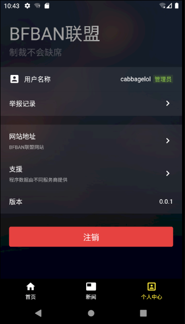

## Bfban应用

   由Cabbagelol负责维护的联Ban移动设备应用，完成对移动设备快速举报功能，改进在移动设备展示效果。

   该应用并非官方，关于隐私问题具体可查看源代码检查应用是否作出此类行为。

## 介绍

> Bfban应用借助FlutterUI库混合原生实现跨平台，可发布android和ios以及桌面应用

  部署android：
  1. android部分仅保留部分资源文件，构建本地android项目需要先"flutter create kotlin ."，再导入克隆项目内的android文件。
  2. 编码模式含'armeabi', 'x86', 'armeabi-v7a', 'x86_64', 'arm64-v8a'NDK，缺少文件到官网下载完整的NDK。
  3. 库里的gradle版本是6.1.1/kotlin:1.3.72，如果和本地不同，请自行修改。
  4. 入口是main_dev不是main。
  
## 分支介绍

- master 引用开发
- weex 旧方案实现(未完成)
